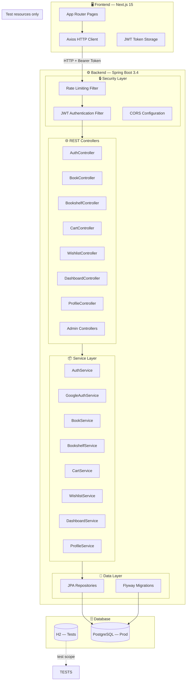
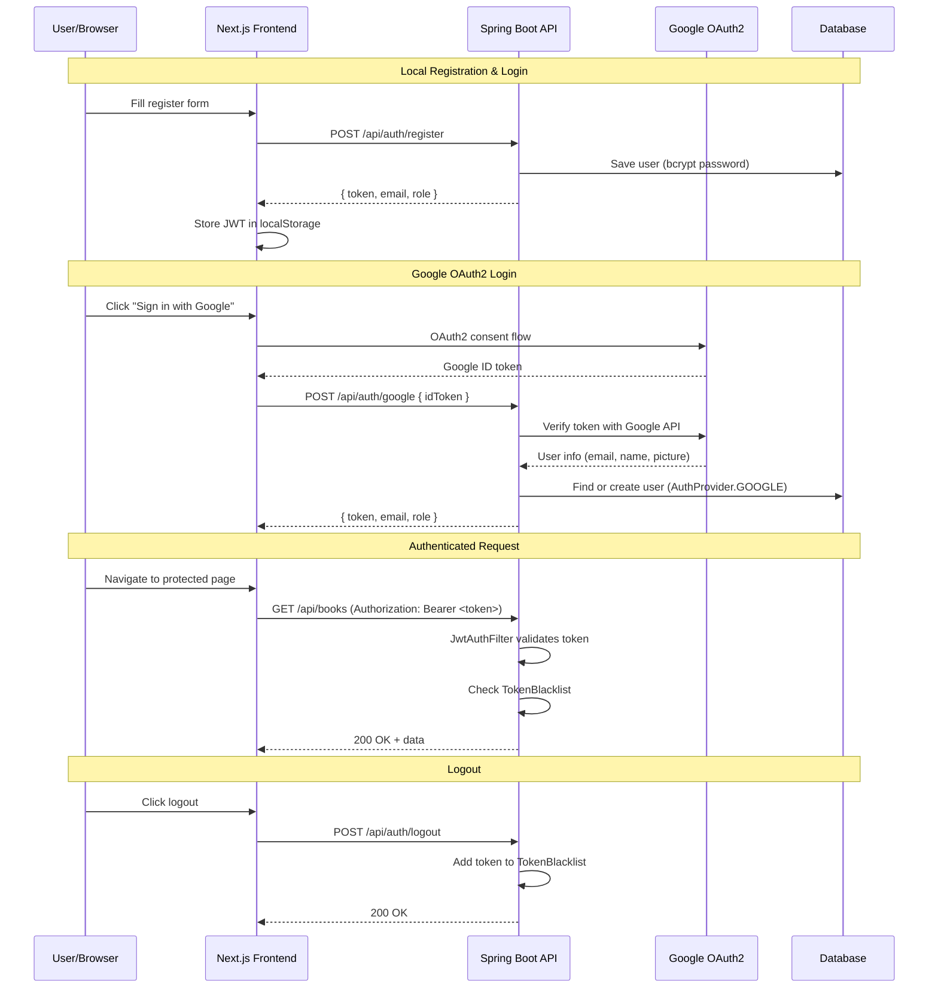
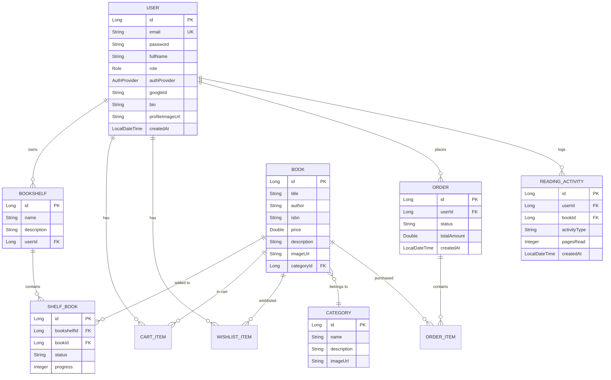
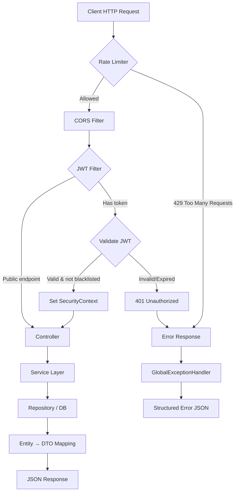
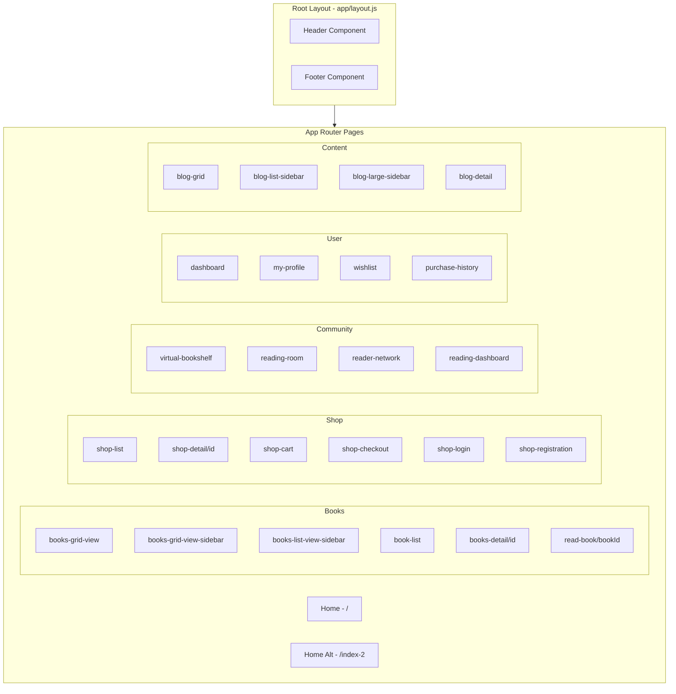
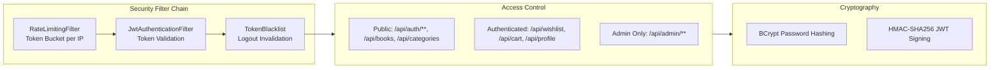

# 📚 ShelfToTales

> A full-stack bookstore and reader-community platform where commerce meets community.

ShelfToTales goes beyond a normal online bookstore — it's a digital home for readers where book discovery, community, sustainability, and reading progress work together.

---

## 🏗️ System Architecture



---

## 🔐 Authentication Flow



---

## 🧱 Backend Architecture (Layered)

```mermaid
graph LR
    subgraph Presentation["Controller Layer"]
        C1[AuthController]
        C2[BookController]
        C3[BookshelfController]
        C4[CartController]
        C5[WishlistController]
        C6[DashboardController]
        C7[ProfileController]
        C8[ShelfBookController]
        C9[CategoryController]
        C10[BookAdminController]
        C11[CategoryAdminController]
    end

    subgraph Business["Service Layer"]
        S1[AuthService]
        S2[BookService]
        S3[BookshelfService]
        S4[CartService]
        S5[WishlistService]
        S6[DashboardService]
        S7[ProfileService]
        S8[ShelfBookService]
        S9[CategoryService]
        S10[GoogleAuthService]
    end

    subgraph Persistence["Repository Layer"]
        R1[UserRepository]
        R2[BookRepository]
        R3[BookshelfRepository]
        R4[CartItemRepository]
        R5[WishlistRepository]
        R6[ShelfBookRepository]
        R7[CategoryRepository]
        R8[OrderRepository]
        R9[ReadingActivityRepository]
    end

    Presentation --> Business
    Business --> Persistence
```



---

## 📊 Database Entity Relationship



---

## 🔄 Request Lifecycle



---

## 🖥️ Frontend Page Architecture



---

## 🛡️ Security Architecture



---

## 🛠️ Tech Stack

| Layer | Technology |
|-------|-----------|
| **Frontend** | Next.js 15.5, React 19, Bootstrap 5, Chart.js, Swiper, Axios |
| **Backend** | Java 17, Spring Boot 3.4, Spring Security, Spring Data JPA |
| **Auth** | JWT (HMAC-SHA256), Google OAuth2, BCrypt |
| **Database** | PostgreSQL (default, all profiles), H2 (test scope only) |
| **API Docs** | Springdoc OpenAPI / Swagger UI |
| **Testing** | Vitest + Testing Library (frontend), JUnit + Mockito (backend) |
| **Build** | Maven (backend), npm (frontend) |
| **Deploy** | Docker Compose |

---

## 📁 Repository Layout

```text
ShelfToTales/
├── backend/shelfToTales/
│   ├── src/main/java/.../
│   │   ├── controller/      # REST endpoints
│   │   ├── service/         # Business logic
│   │   ├── repository/      # Data access (JPA)
│   │   ├── model/           # Entity classes
│   │   ├── dto/             # Request/Response objects
│   │   ├── security/        # JWT filter, rate limiter
│   │   ├── config/          # Security, CORS, OpenAPI
│   │   ├── exception/       # Global error handling
│   │   └── util/            # Helpers (TokenBlacklist, etc.)
│   ├── src/main/resources/
│   │   ├── application.properties
│   │   └── db/migration/    # Flyway SQL scripts
│   ├── Dockerfile
│   └── docker-compose.yml
├── frontend-next/
│   ├── app/
│   │   ├── layout.js        # Root layout
│   │   ├── page.js          # Home page
│   │   ├── lib/api.js       # Axios client
│   │   ├── components/      # Shared UI components
│   │   ├── books-grid-view/ # Book browsing pages
│   │   ├── shop-login/      # Auth pages
│   │   ├── dashboard/       # User dashboard
│   │   ├── virtual-bookshelf/
│   │   └── ...              # 30+ route directories
│   ├── public/assets/
│   ├── package.json
│   └── vitest.config.mjs
└── README.md
```

---

## 🚀 Getting Started

### Prerequisites

- Java 17+
- Node.js 18+
- Docker Desktop (optional, for PostgreSQL)

### Backend

```bash
cd backend/shelfToTales
./mvnw spring-boot:run
```

- API: `http://localhost:8080`
- Swagger UI: `http://localhost:8080/swagger-ui.html`
- H2 Console: only available when running the test profile (default profile is PostgreSQL, so the H2 console is not exposed)

### Frontend

```bash
cd frontend-next
npm install
npm run dev
```

- App: `http://localhost:3000`

### Docker (Full Stack)

```bash
cd backend/shelfToTales
docker compose up --build
```

---

## 📡 API Endpoints

### Public

| Method | Path | Description |
|--------|------|-------------|
| POST | `/api/auth/register` | Register new user |
| POST | `/api/auth/login` | Login (returns JWT) |
| POST | `/api/auth/google` | Google OAuth2 login |
| GET | `/api/books` | List/search books |
| GET | `/api/books/{id}` | Get book details |
| GET | `/api/categories` | List categories |

### Authenticated (Bearer Token)

| Method | Path | Description |
|--------|------|-------------|
| GET | `/api/wishlist` | User's wishlist |
| POST | `/api/wishlist/{bookId}` | Add to wishlist |
| DELETE | `/api/wishlist/{bookId}` | Remove from wishlist |
| GET/POST | `/api/cart` | Cart operations |
| GET/POST | `/api/bookshelves` | Manage bookshelves |
| GET | `/api/dashboard` | Reading dashboard data |
| GET/PUT | `/api/profile` | User profile |

### Admin (ROLE_ADMIN)

| Method | Path | Description |
|--------|------|-------------|
| POST | `/api/admin/books` | Create book |
| PUT | `/api/admin/books/{id}` | Update book |
| DELETE | `/api/admin/books/{id}` | Delete book |
| POST/PUT/DELETE | `/api/admin/categories/{id}` | Manage categories |

---

## 🧪 Testing

```bash
# Backend unit & integration tests
cd backend/shelfToTales
./mvnw test

# Frontend component tests
cd frontend-next
npm test
```

---

## 🎯 Feature Status

| Feature | Status | Notes |
|---------|--------|-------|
| Shopping Cart | ✅ Done | Add/remove/update quantity works |
| Checkout System | ⚠️ Partial | Real checkout exists; UI still needs fuller payment UX |
| Product Catalog | ✅ Done | Listings, details, category views |
| Order Management | ✅ Done | History, detail, admin status updates |
| User Accounts & Auth | ✅ Done | Register, login, JWT, Google OAuth2 |
| Wishlist / Favorites | ✅ Done | Add, remove, list |
| Product Comparison | ✅ Done | Compare list built in |
| Quick View | ✅ Done | Modal-based quick view exists |
| Blog / Content System | ✅ Done | Create, read, update, delete posts |
| Books by Category | ✅ Done | Category browsing wired |
| Search | ✅ Done | Title, author, ISBN, semantic search |
| Product Filtering | ✅ Done | Price, genre, stock, rating filters |
| Blog Management | ⚠️ Partial | User-scoped CRUD exists; admin blog CRUD not separate |
| Rich Blog Posts | ❌ Missing | No gallery/video embed editor found |
| AI Image Search | ❌ Missing | No cover-image upload search pipeline |
| Mood-Based Suggestions | ✅ Done | Mood-to-book recommendations in place |
| Full Checkout Flow | ⚠️ Partial | Cart → payment → confirmation improved, still room for polish |
| Virtual Bookshelves | ✅ Done | Read / reading / want-to-read shelves |
| Spoiler-Free Zones | ⚠️ Partial | Reported spoilers and review-level handling, not broad feed filter |
| Virtual Reading Rooms | ✅ Done | Real-time co-reading + chat + lofi |
| Peer Book Exchange | ✅ Done | Listings, requests, accept/reject flow |
| Donation System | ✅ Done | Donate and request books |
| Reading Challenges | ✅ Done | Goals and challenge tracking |
| Smart Annotations | ✅ Done | Quote sharing to feed from reader |
| Moderation Tools | ⚠️ Partial | Reports + admin actions exist; coverage still uneven |
| Analytics Dashboard | ⚠️ Partial | Real stats now; some visuals still basic |
| Real-Time Security Monitoring | ✅ Done | Security summary and events endpoint |
| Secure User Management | ✅ Done | Admin roles, moderation roles, user controls |

---

## 👥 Team

| Name | ID |
|------|-----|
| Rushdania Bushra | 0112230039 |
| Habiba Khatun | 011221085 |
| Fayjullah Haque | 011221072 |
| Ashikur Rahman Puspo | 0112310304 |
| Mst. Sumia Khatun | 011221563 |

---

## 📄 License

This project is developed as part of an academic course (AOOP).
