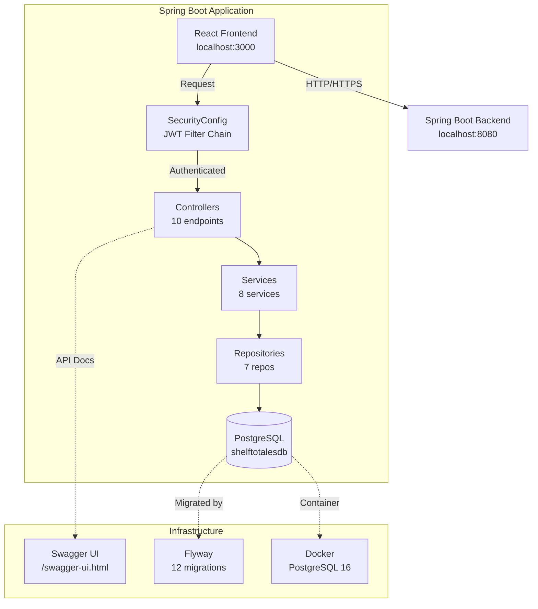
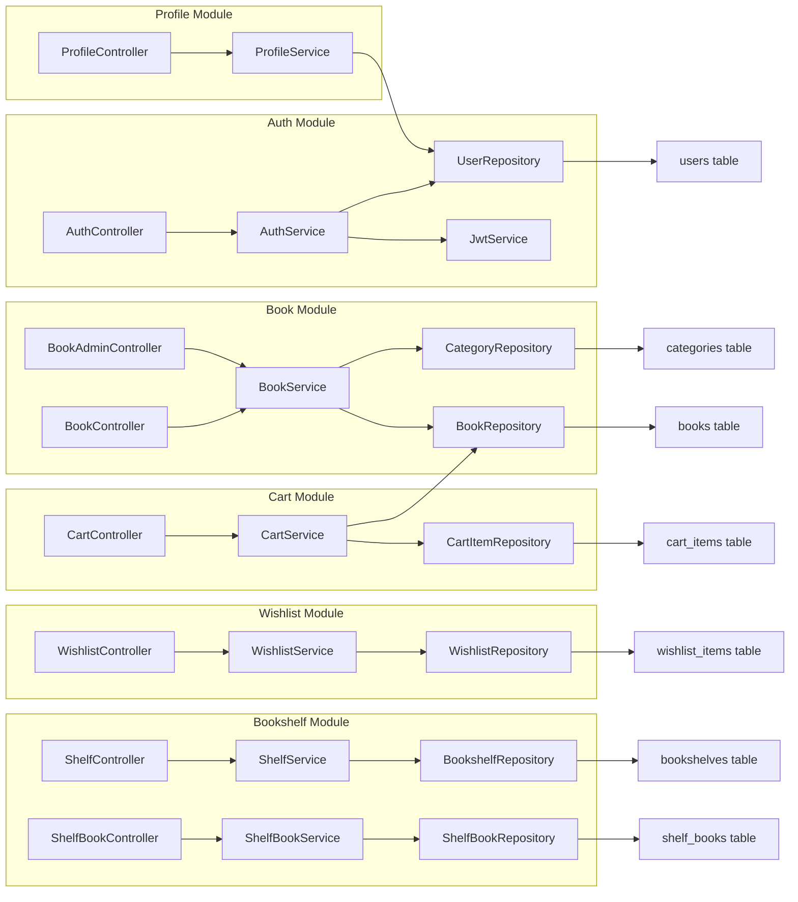
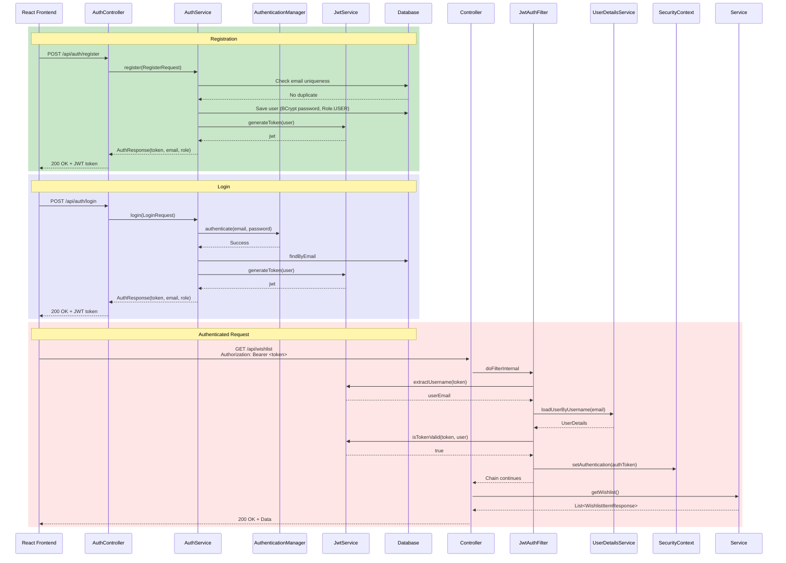
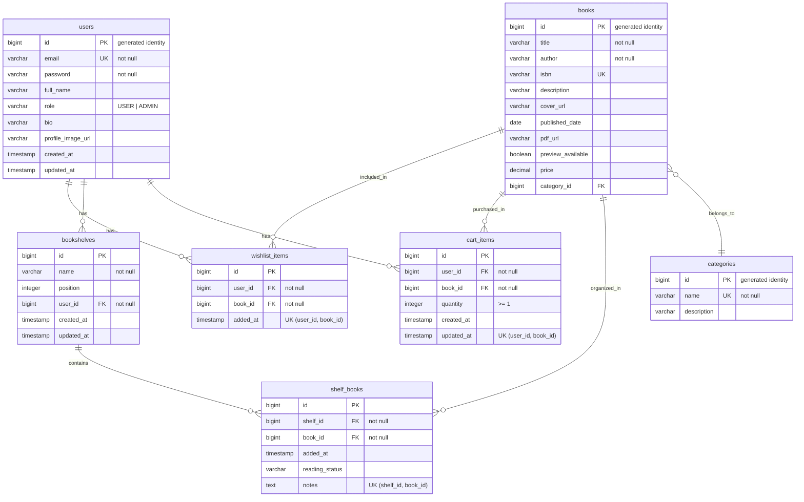
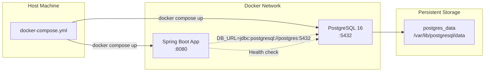
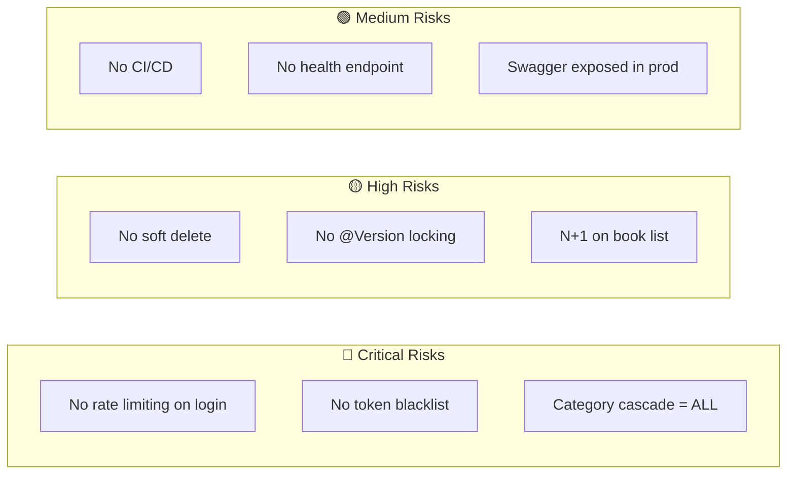
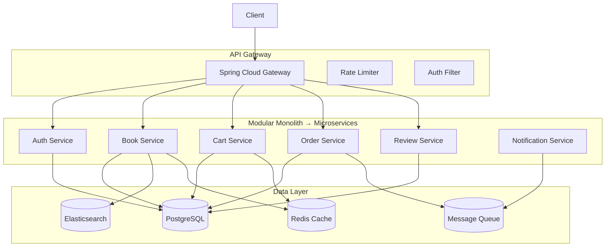
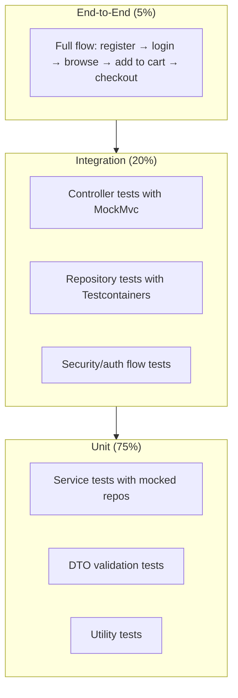
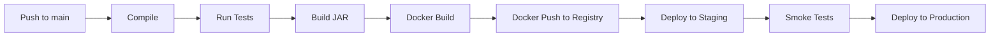

# Shelf To Tales — Backend Architecture & Audit

**Version 1.0.0** · Spring Boot 3.4 · Java 17 · PostgreSQL 16  
**Audit Date:** May 15, 2026  
**Auditor:** Senior Backend Architecture Review  


---

## Table of Contents

1. [Project Overview](#1-project-overview)
2. [Vision & Product Goal](#2-vision--product-goal)
3. [Current Backend Architecture](#3-current-backend-architecture)
4. [Package Structure Explanation](#4-package-structure-explanation)
5. [Authentication & Security Flow](#5-authentication--security-flow)
6. [JWT Architecture](#6-jwt-architecture)
7. [Database Design](#7-database-design)
8. [Flyway Migration Strategy](#8-flyway-migration-strategy)
9. [API Design Principles](#9-api-design-principles)
10. [Exception Handling Strategy](#10-exception-handling-strategy)
11. [Docker & Deployment](#11-docker--deployment)
12. [Current Features](#12-current-features)
13. [Planned Features](#13-planned-features)
14. [Persistence Design Strategy](#14-persistence-design-strategy)
15. [Security Audit](#15-security-audit)
16. [Performance Audit](#16-performance-audit)
17. [Scalability Considerations](#17-scalability-considerations)
18. [Production Readiness Audit](#18-production-readiness-audit)
19. [Technical Debt](#19-technical-debt)
20. [Recommended Improvements](#20-recommended-improvements)
21. [Future Architecture Evolution](#21-future-architecture-evolution)
22. [Testing Strategy](#22-testing-strategy)
23. [Environment Configuration](#23-environment-configuration)
24. [Swagger Usage](#24-swagger-usage)
25. [Development Workflow](#25-development-workflow)
26. [CI/CD Recommendations](#26-cicd-recommendations)
27. [Monitoring & Logging Recommendations](#27-monitoring--logging-recommendations)
28. [Final Engineering Assessment](#28-final-engineering-assessment)

---

## 1. Project Overview

Shelf To Tales is a Spring Boot 3.4 backend for an online bookstore platform. It provides REST APIs for browsing books, managing wishlists, shopping carts, virtual bookshelves, PDF reading, and user profiles. The system uses JWT authentication with USER/ADMIN role-based authorization, Flyway-managed PostgreSQL schema, and Docker containerization.

**Repository Stats:**
- 59 Java source files across 8 packages
- 2,309 lines of Java code
- 12 Flyway migrations
- 1 test file (context load)
- 7 modules: Auth, Books, Categories, Wishlist, Cart, Bookshelves, Profile

---

## 2. Vision & Product Goal

Shelf To Tales aims to be a production-grade digital bookstore backend supporting:

- **Browsing & Discovery** — Paginated book search with title/author filters and category navigation
- **User Engagement** — Wishlists, bookshelves, reading history, and PDF access
- **Commerce** — Shopping cart with quantity management and price calculation
- **Social & Community** — Future: reviews, ratings, reading rooms, AI recommendations (planned)
- **Admin Operations** — Full CRUD for books and categories with role-based access

The architecture is designed as a modular monolith, structured so individual modules can be extracted into microservices as the platform grows.

---

## 3. Current Backend Architecture



### Module Dependency Graph



---

## 4. Package Structure Explanation

```
backend/shelfToTales/src/main/java/com/example/shelftotales/
├── config/          (5 files)    → Security, Flyway, OpenAPI, Application, DataSeeder
├── controller/      (10 files)   → REST endpoints (public + admin + auth)
├── dto/             (17 files)   → Request/Response DTOs + PagedResponse
├── exception/       (1 file)     → GlobalExceptionHandler + ErrorResponse
├── model/           (8 files)    → JPA entities
├── repository/      (7 files)    → Spring Data JPA interfaces
├── security/        (2 files)    → JwtService, JwtAuthenticationFilter
└── service/         (8 files)    → Business logic
```

### Layer Responsibilities

| Layer | Responsibility | Rules |
|---|---|---|
| `controller/` | HTTP entry points | Thin — delegates to services. No business logic. DTO in/out only. |
| `service/` | Business logic + transactions | `@Transactional` on writes. `getAuthenticatedUser()` for auth context. |
| `repository/` | Data access | Spring Data JPA. Custom `@Query` with `JOIN FETCH` where needed. |
| `model/` | JPA entities | Annotations only. No business logic. LAZY fetch everywhere. |
| `dto/` | Data transfer | `@Builder` + `@Getter`. Never expose entities to controllers. |
| `config/` | Framework config | Bean definitions, security rules, Flyway wiring. |
| `security/` | JWT infrastructure | Token generation, validation, request filtering. |
| `exception/` | Error handling | `@RestControllerAdvice` — consistent JSON errors. |

### Clean Architecture Compliance

- ✅ **Dependency Rule:** Controllers depend on services, services depend on repositories. Never the reverse.
- ✅ **DTO Boundary:** Entities never leave the service layer. All responses go through DTO mapping.
- ✅ **Interface Segregation:** Each repository is focused on one entity.
- ✅ **Single Responsibility:** Services are module-scoped (BookService, CartService, etc.).
- ❌ **Missing:** `util/` package for cross-cutting concerns (e.g., shared `getAuthenticatedUser()`).

---

## 5. Authentication & Security Flow



### JWT Token Structure

```json
{
  "sub": "user@example.com",
  "role": "USER",
  "iat": 1715000000,
  "exp": 1715086400
}
```

| Claim | Value | Description |
|---|---|---|
| `sub` | email | Subject = user email (used as username) |
| `role` | `USER` or `ADMIN` | Custom claim for authorization |
| `iat` | timestamp | Issued at |
| `exp` | timestamp | 24 hours from issue (configurable via `jwt.expiration-ms`) |

---

## 6. JWT Architecture

### Token Lifecycle


### Key Implementation Decisions

| Decision | Choice | Rationale |
|---|---|---|
| Signing algorithm | HMAC-SHA256 | Symmetric — simple, fast, no key pair management. Sufficient for single-service deployment. |
| Key source | `jwt.secret-key` property | Configurable via env var `JWT_SECRET_KEY`. Falls back to dev default (safe fail in prod? No — **must be set**). |
| Expiration | 24 hours | Configurable via `jwt.expiration-ms`. Trade-off: longer = fewer logins, shorter = more secure. |
| Claims | `sub` + `role` | Minimal. Role included for stateless authorization without DB lookup on every request. |
| Filter position | Before `UsernamePasswordAuthenticationFilter` | Standard placement — intercepts before Spring's form login. |

### Security Gaps

| Gap | Risk | Mitigation |
|---|---|---|
| No token blacklist | Stolen token valid for 24h | Add Redis blacklist + `/api/auth/logout` |
| No refresh tokens | Users re-login after 24h | Add refresh token rotation (short-lived access + long-lived refresh) |
| Secret in defaults | Prod might use dev default | Add `@PostConstruct` validation: fail if secret equals default |

---

## 7. Database Design

### Current Entity Relationship Diagram



### Complete Index Strategy

| Table | Index | Type | Purpose |
|---|---|---|---|
| `books` | `idx_books_title` | B-tree | Title search (prefix) |
| `books` | `idx_books_author` | B-tree | Author search (prefix) |
| `books` | `idx_books_category_id` | B-tree | Category filter |
| `books` | `uq_books_isbn` | UNIQUE | ISBN lookup |
| `categories` | `uq_categories_name` | UNIQUE | Category lookup |
| `users` | `uq_users_email` | UNIQUE | Login lookup |
| `wishlist_items` | `uq_wishlist_user_book` | UNIQUE | Duplicate prevention |
| `wishlist_items` | `idx_wishlist_user_id` | B-tree | User's wishlist query |
| `cart_items` | `uq_cart_user_book` | UNIQUE | Duplicate prevention |
| `cart_items` | `idx_cart_items_user_id` | B-tree | User's cart query |
| `bookshelves` | `idx_bookshelves_user_id` | B-tree | User's shelves |
| `bookshelves` | `idx_bookshelves_user_position` | B-tree | Ordering |
| `shelf_books` | `uq_shelf_book` | UNIQUE | Duplicate prevention |
| `shelf_books` | `idx_shelf_books_shelf_id` | B-tree | Shelf's books |
| `shelf_books` | `idx_shelf_books_book_id` | B-tree | Reverse lookup |

### Composite Unique Constraints

| Table | Constraint | Benefit |
|---|---|---|
| `cart_items` | `UNIQUE (user_id, book_id)` | Prevents duplicate cart rows at DB level — race-condition-proof |
| `shelf_books` | `UNIQUE (shelf_id, book_id)` | Prevents duplicate books in shelf |
| `wishlist_items` | `UNIQUE (user_id, book_id)` | Prevents duplicate wishlist entries |

**Why DB-level constraints matter:** Application-level `if(exists) { throw }` checks have a TOCTOU race window. Two concurrent requests can both pass the check and both insert. The DB constraint is the only guarantee.

---

## 8. Flyway Migration Strategy

### Migration Inventory

| Version | Name | Content |
|---|---|---|
| V1 | `Create_categories_table` | Categories table |
| V2 | `Create_users_table` | Users table with role |
| V3 | `Create_books_table` | Books with FK to categories |
| V4 | `Create_wishlist_items_table` | Wishlist with FKs |
| V5 | `Seed_categories_and_books` | 3 categories, 3 books |
| V6 | `Add_book_search_indexes` | Indexes on title, author, category_id |
| V7 | `Add_pdf_columns_to_books` | pdf_url, preview_available, price |
| V8 | `Create_bookshelves_table` | Bookshelves with position |
| V9 | `Create_cart_items_table` | Cart items with quantity + unique constraint |
| V10 | `Add_profile_fields_to_users` | Bio, profile_image_url, updated_at |
| V11 | `Create_shelf_books_join_table` | Join entity with metadata |
| V12 | `Add_wishlist_unique_constraint_and_index` | Wishlist dedup + index |

### Migration Principles

- **Immutable:** Once applied to production, migrations are never modified. Corrections are new versions.
- **Ordered:** Semantic versioning — V1–V5 are core schema, V6+ are feature additions.
- **Idempotent:** Seed data uses `INSERT` with explicit IDs to prevent duplicates on re-run.
- **H2-Compatible:** All migrations work on both H2 (tests) and PostgreSQL (production).

### Production Safety Rules

1. **Never** delete a migration that's been applied to prod
2. **Never** reorder migration versions
3. **Test** new migrations against a copy of production data
4. **Backup** before applying migrations in production
5. **Use** `flyway repair` if a migration fails mid-way (don't manually edit `flyway_schema_history`)

---

## 9. API Design Principles

### Endpoint Organization

| Path Pattern | Auth Required | Role Required |
|---|---|---|
| `GET /api/auth/**` | No | — |
| `POST /api/auth/**` | No | — |
| `GET /api/books/**` | No | — |
| `GET /api/categories/**` | No | — |
| `GET/POST/PUT/DELETE /api/wishlist/**` | Yes | — |
| `GET/POST/PUT/DELETE /api/cart/**` | Yes | — |
| `GET/POST/PUT/DELETE /api/bookshelves/**` | Yes | — |
| `GET/PUT /api/profile` | Yes | — |
| `POST/PUT/DELETE /api/admin/books/**` | Yes | ADMIN |
| `POST/PUT/DELETE /api/admin/categories/**` | Yes | ADMIN |
| All others | Yes | — |

### Implemented Endpoints

| Method | Path | Description | Response |
|---|---|---|---|
| `POST` | `/api/auth/register` | Register new user | `AuthResponse` |
| `POST` | `/api/auth/login` | Login | `AuthResponse` |
| `GET` | `/api/books` | Browse with pagination, search, category filter | `PagedResponse<BookResponse>` |
| `GET` | `/api/books/{id}` | Book details | `BookResponse` |
| `GET` | `/api/books/{id}/read` | PDF reading info | `ReadBookResponse` |
| `GET` | `/api/categories` | List categories | `List<Category>` |
| `GET` | `/api/wishlist` | Get user's wishlist | `List<WishlistItemResponse>` |
| `POST` | `/api/wishlist/{bookId}` | Add to wishlist | `200 OK` |
| `DELETE` | `/api/wishlist/{bookId}` | Remove from wishlist | `204 No Content` |
| `GET` | `/api/cart` | Get cart with totals | `CartResponse` |
| `POST` | `/api/cart/{bookId}` | Add/increment cart item | `CartResponse` |
| `PUT` | `/api/cart/{bookId}` | Update quantity | `CartResponse` |
| `DELETE` | `/api/cart/{bookId}` | Remove from cart | `204 No Content` |
| `GET` | `/api/bookshelves` | Get user's shelves | `List<BookshelfResponse>` |
| `POST` | `/api/bookshelves` | Create shelf | `BookshelfResponse` |
| `PUT` | `/api/bookshelves/{id}` | Rename shelf | `BookshelfResponse` |
| `DELETE` | `/api/bookshelves/{id}` | Delete shelf | `204 No Content` |
| `POST` | `/api/bookshelves/reorder` | Reorder shelves | `200 OK` |
| `GET` | `/api/bookshelves/{shelfId}/books` | Books in shelf | `List<ShelfBookResponse>` |
| `POST` | `/api/bookshelves/{shelfId}/books/{bookId}` | Add book to shelf | `ShelfBookResponse` |
| `DELETE` | `/api/bookshelves/{shelfId}/books/{bookId}` | Remove book from shelf | `204 No Content` |
| `GET` | `/api/profile` | Get profile | `ProfileResponse` |
| `PUT` | `/api/profile` | Update profile | `ProfileResponse` |
| `POST` | `/api/admin/books` | Create book (ADMIN) | `BookResponse` |
| `PUT` | `/api/admin/books/{id}` | Update book (ADMIN) | `BookResponse` |
| `DELETE` | `/api/admin/books/{id}` | Delete book (ADMIN) | `204 No Content` |

### HTTP Status Usage

| Status | When |
|---|---|
| `200 OK` | Successful GET, POST, PUT |
| `201 Created` | Successful POST (book, bookshelf, shelf book created) |
| `204 No Content` | Successful DELETE |
| `400 Bad Request` | Validation failure, illegal argument, duplicate |
| `401 Unauthorized` | Bad credentials, missing/invalid JWT |
| `403 Forbidden` | Authenticated but not ADMIN |
| `404 Not Found` | Resource not found |
| `500 Internal Server Error` | Unexpected server error |

---

## 10. Exception Handling Strategy

```mermaid
graph TD
    A[Controller] -->|Exception thrown| B[GlobalExceptionHandler]
    B --> C{Exception type?}
    C -->|MethodArgumentNotValid| D[400 + field errors]
    C -->|IllegalArgument| E[400 + message]
    C -->|BadCredentials| F[401 + "Invalid email or password"]
    C -->|AccessDenied| G[403 + "Forbidden"]
    C -->|UsernameNotFound| H[404 + message]
    C -->|RuntimeException| I[500 + generic message]
    C -->|Exception| J[500 + generic message]
    D --> K[ErrorResponse JSON]
    E --> K
    F --> K
    G --> K
    H --> K
    I --> K
    J --> K
```

### ErrorResponse Format

```json
{
  "status": 400,
  "error": "Validation Failed",
  "message": "One or more fields are invalid",
  "timestamp": "2026-05-15T12:00:00",
  "details": {
    "email": "Email is required",
    "password": "Password must be at least 6 characters"
  }
}
```

All errors consistently return this structure. No stack traces leak to production.

---

## 11. Docker & Deployment



### Dockerfile

- **Base:** `eclipse-temurin:17-jdk-alpine` (lightweight, 150MB)
- **Multi-stage:** Build + runtime stages separate
- **Exposed port:** 8080
- **Entry point:** `java -jar app.jar`

### docker-compose.yml

| Service | Image | Port | Dependencies |
|---|---|---|---|
| `postgres` | `postgres:16-alpine` | 5432 | — |
| `app` | Build from Dockerfile | 8080 | `postgres` (healthy) |

**Environment variable overrides for Docker:**
```yaml
DB_URL: jdbc:postgresql://postgres:5432/shelftotalesdb
DB_USERNAME: shelftotales
DB_PASSWORD: shelftotales_password
```

---

## 12. Current Features

| Module | Status | Key Files |
|---|---|---|
| **Auth** | ✅ Complete | `AuthController`, `AuthService`, `JwtService`, `JwtAuthenticationFilter` |
| **Books** | ✅ Complete | `BookController`, `BookService`, `BookRepository` |
| **Admin CRUD** | ✅ Complete | `BookAdminController`, `CategoryAdminController` |
| **Categories** | ✅ Complete | `CategoryController`, `CategoryService` |
| **Wishlist** | ✅ Complete | `WishlistController`, `WishlistService`, `WishlistRepository` |
| **Cart** | ✅ Complete | `CartController`, `CartService`, `CartItemRepository` |
| **Bookshelves** | ✅ Complete | `BookshelfController`, `BookshelfService`, `BookshelfRepository` |
| **Shelf Books** | ✅ Complete | `ShelfBookController`, `ShelfBookService`, `ShelfBookRepository` |
| **PDF Reading** | ✅ Complete | `BookController.getReadBookInfo()`, `ReadBookResponse` |
| **Profile** | ✅ Complete | `ProfileController`, `ProfileService` |
| **Swagger** | ✅ Complete | `OpenApiConfig`, all `@Operation` annotations |
| **Flyway** | ✅ Complete | 12 migrations |
| **Docker** | ✅ Complete | `Dockerfile`, `docker-compose.yml` |
| **Error Handling** | ✅ Complete | `GlobalExceptionHandler` |
| **Security Config** | ✅ Complete | `SecurityConfig` with roles, CORS, method security |

---

## 13. Planned Features

| Feature | Priority | Schema Impact | Estimated Effort |
|---|---|---|---|
| Orders / Checkout | P0 | New `orders`, `order_items` tables | 2 weeks |
| Email Verification | P0 | New `email_verifications` table | 3 days |
| Password Reset | P0 | New `password_reset_tokens` table | 2 days |
| Reviews & Ratings | P1 | New `reviews` table | 1 week |
| Author Profiles | P1 | New `authors` table | 2 days |
| AI Recommendations | P2 | Analytics events table + external AI | 2-3 weeks |
| Reading Rooms | P2 | WebSocket support + `rooms` table | 3 weeks |
| Social Features | P3 | `follows`, `activity_feed` tables | 2 weeks |

---

## 14. Persistence Design Strategy

### Fetch Type Analysis

| Relationship | Type | Correct? | Notes |
|---|---|---|---|
| `Book → Category` | `LAZY` | ✅ | Loaded on demand via DTO |
| `Category → Book` | `LAZY` | ✅ | Never load books when listing categories |
| `CartItem → User` | `LAZY` | ✅ | |
| `CartItem → Book` | `LAZY` | ✅ | With `JOIN FETCH` in repository |
| `Bookshelf → User` | `LAZY` | ✅ | |
| `ShelfBook → Book` | `LAZY` | ✅ | With `JOIN FETCH` in repository |
| `WishlistItem → Book` | `LAZY` | ✅ | With `JOIN FETCH` in repository |
| `WishlistItem → User` | `LAZY` | ✅ | |

**All fetch types are correctly LAZY. No EAGER leaks.**

### Cascade Rules Audit

| Parent → Child | Cascade | Risk |
|---|---|---|
| `Category → Book` | **`ALL`** | 🔴 Deleting a category cascades to ALL books. **Change to no cascade.** |
| `User → CartItem` | None | ✅ Correct |
| `User → WishlistItem` | None | ✅ Correct |
| `User → Bookshelf` | None | ✅ Correct |
| `Bookshelf → ShelfBook` | None | ✅ Uses `ON DELETE CASCADE` in DB |

### N+1 Query Audit

| Query | Pattern | Status |
|---|---|---|
| Book search → category name | `b.getCategory().getName()` | ❌ **Missing `JOIN FETCH b.category`** — N+1 per page |
| Wishlist → book details | `item.getBook()` per row | ✅ `JOIN FETCH w.book` in `findByUserIdWithBook` |
| Cart → book details | `item.getBook()` per row | ✅ `JOIN FETCH c.book` in `findByUserIdWithBook` |
| Shelf books → book details | `sb.getBook()` per row | ✅ `JOIN FETCH sb.book` in `findByBookshelfIdWithBook` |

**Remaining N+1:** Book list pagination — accessing `book.getCategory().getName()` in `BookService.toResponse()` triggers 1 query per book on every page. Fix: add `LEFT JOIN FETCH b.category` to the `searchBooks` JPQL query.

### DTO Mapping Strategy

Manual `toResponse()` in each service. Rationale:
- Zero reflection overhead (vs ModelMapper)
- Compile-time safety (vs MapStruct requires annotation processing)
- Simple for 17 DTOs

If DTO count exceeds 25, migrate to **MapStruct** (compile-time code generation, no runtime reflection).

---

## 15. Security Audit

### API Security Matrix

| Endpoint | Auth | Role | Rate Limited | Notes |
|---|---|---|---|---|
| `POST /api/auth/register` | ✗ | — | ❌ | No brute-force protection |
| `POST /api/auth/login` | ✗ | — | ❌ | **High risk** — unlimited attempts |
| `GET /api/books/**` | ✗ | — | — | Public, acceptable |
| `GET /api/categories/**` | ✗ | — | — | Public, acceptable |
| All others | JWT | — | — | Authenticated |
| `/api/admin/**` | JWT | ADMIN | — | Admins only |

### Security Checklist

| Check | Status | Notes |
|---|---|---|
| JWT signing | ✅ | HMAC-SHA256 with configurable key |
| Password hashing | ✅ | BCrypt via `BCryptPasswordEncoder` |
| Role enforcement (URL level) | ✅ | `.requestMatchers("/api/admin/**").hasRole("ADMIN")` |
| Role enforcement (method level) | ✅ | `@EnableMethodSecurity` + `@PreAuthorize` |
| CORS centralized | ✅ | Single source in `SecurityConfig` |
| Input validation | ✅ | `@Valid` + `@NotBlank` + `@Size` + `@Email` |
| SQL injection protection | ✅ | JPA parameterized queries |
| CSRF disabled (correct for JWT) | ✅ | Stateless sessions — no CSRF risk |
| Rate limiting | ❌ | **Missing** — critical for auth endpoints |
| Logout / token blacklist | ❌ | **Missing** — no way to revoke tokens |
| Account lockout | ❌ | **Missing** — unlimited login attempts |
| Email verification | ❌ | Anyone can register with any email |

### Risk Assessment



---

## 16. Performance Audit

### Current Metrics

| Metric | Value |
|---|---|
| Java files | 59 |
| Lines of code | 2,309 |
| Migrations | 12 |
| Tests | 1 (context load only) |
| Test-to-code ratio | 1:2,309 |
| Cache layer | None |
| Connection pool | Default Hikari (unbounded) |

### Bottleneck Analysis

| Area | Risk | Impact |
|---|---|---|
| Book listing | N+1 on category per page | ~21 queries per page load |
| No caching | Every request hits DB | 1000 users = 1000 DB connections |
| Connection pool | Default config | No max connections set |
| Serialization | DTO mapping per request | Acceptable for current scale |

### Recommendation: Add `JOIN FETCH` to Book Search

**Current query (N+1):**
```java
@Query("SELECT b FROM Book b WHERE ...")
Page<Book> searchBooks(...);
// Accessing b.category.name per row = N extra queries
```

**Fixed query:**
```java
@Query("SELECT b FROM Book b LEFT JOIN FETCH b.category WHERE ...")
Page<Book> searchBooks(...);
// Category loaded in the same query
```

---

## 17. Scalability Considerations

### Scalability Scoring

| Factor | Score | Reasoning |
|---|---|---|
| Stateless API | 10/10 | JWT auth — no session affinity needed |
| Module decomposition | 9/10 | Each module independently extractable |
| Database schema | 7/10 | Good indexes, no partitioning, no read replicas |
| Caching | 2/10 | Zero cache — every request hits DB |
| Async processing | 3/10 | No `@Async`, no message queue, no event bus |
| **Overall** | **7.5/10** | **Good foundation, gaps in caching and async** |

### Scaling Patterns Available

- **Horizontal scaling:** Add more app instances behind a load balancer. Stateless JWT makes this trivial.
- **Read replicas:** Move read queries to PostgreSQL replicas. Reads >> writes in bookstore.
- **Caching:** Add Redis for book listing, categories, and session blacklist.
- **CQRS:** Separate read/write models for book search if needed.

### Bottleneck Prediction

At ~1,000 concurrent users:
1. DB connection pool exhausts (default Hikari = unbounded)
2. Book listing slows (N+1 category queries + no cache)
3. Auth endpoint under brute force (no rate limiting)

---

## 18. Production Readiness Audit

### Readiness Scorecard

| Category | Score | Critical Gaps |
|---|---|---|
| Architecture | 8/10 | Clean layers, few gaps |
| Security | 7/10 | Rate limit, logout, lockout missing |
| Database | 7/10 | Soft delete missing, 1 cascade risk |
| API Design | 8/10 | RESTful, well-documented |
| Performance | 5/10 | No cache, N+1 remains in book list |
| DevOps | 6/10 | Docker ready, no CI/CD |
| Code Quality | 7/10 | Clean, some duplication |
| Testing | 1/10 | Essentially untested |
| **Overall** | **6.8/10** | **Needs 3 weeks of hardening** |

### Go/No-Go Checklist

**Must pass before production launch:**
- [ ] Rate limiting on auth endpoints
- [ ] Logout + token blacklist
- [ ] `JOIN FETCH b.category` fix
- [ ] Soft delete on books + categories
- [ ] Connection pool configuration
- [ ] Health check endpoint
- [ ] Password reset flow
- [ ] Integration tests passing

---

## 19. Technical Debt

| Debt | Impact | Effort to Fix |
|---|---|---|
| `getAuthenticatedUser()` duplicated in 6 services | Maintainability — adding auth logic requires 6 edits | 30 min |
| `Category.cascade = ALL` on books | Data loss risk if admin deletes a category | 10 min |
| `BookshelfResponse.bookCount` hardcoded to 0 | Confusing API response | 15 min |
| No `util/` package | Cross-cutting concerns scattered | 1 hour restructure |
| CORS origin hardcoded in SecurityConfig | Deployment friction — must edit code per environment | 5 min |
| No application-prod.properties | Dev config leaks to production | 30 min |

---

## 20. Recommended Improvements

### Immediate (Before Production)

| Priority | Change | Files |
|---|---|---|
| P0 | Add `LEFT JOIN FETCH b.category` to `searchBooks` | `BookRepository.java` |
| P0 | Remove `cascade = ALL` on `Category.books` | `Category.java` |
| P0 | Add rate limiting to auth endpoints | `SecurityConfig.java` + Bucket4j |
| P0 | Add logout endpoint + token blacklist | `AuthController.java`, `AuthService.java` |
| P0 | Add connection pool config | `application.properties` |

### Short-Term (First Sprint)

| Priority | Change |
|---|---|
| P1 | Add `@Version` to Book, CartItem, WishlistItem |
| P1 | Add soft delete V13 migration + `@Where` on Book + Category |
| P1 | Add `@Transactional(readOnly = true)` on all GET services |
| P1 | Add Testcontainers integration tests for core flows |
| P1 | Extract `getAuthenticatedUser()` to `util/AuthUtils.java` |

### Medium-Term (Second Sprint)

| Priority | Change |
|---|---|
| P2 | Add Redis caching for book listing (`@Cacheable`) |
| P2 | Add Spring Boot Actuator with health endpoint |
| P2 | Add CI/CD pipeline (GitHub Actions) |
| P2 | Add `application-prod.properties` profile |
| P2 | Add API versioning prefix `/api/v1/` |

---

## 21. Future Architecture Evolution

### Near-Future Architecture (3–6 months)



### Extraction Strategy

| Module | Extract As | Dependent On |
|---|---|---|
| Auth | Auth Service | UserRepository only |
| Books + Categories | Book Service | CategoryRepository only |
| Cart | Cart Service | Book Service (reads prices) |
| Orders | Order Service | Book Service, Cart Service |
| Reviews | Review Service | Book Service, Auth Service |
| Recommendations | AI Service | Book Service, Analytics DB |

### Anti-Patterns to Avoid

1. **Shared database across services** — Each microservice owns its data. Use events for cross-service consistency.
2. **Synchronous coupling** — Order creation should emit an event, not call Notification Service directly.
3. **Shared entities** — Don't share JPA entities between services. Each service has its own data model.
4. **Fat gateway** — API Gateway routes and rate-limits only. No business logic.

---

## 22. Testing Strategy

### Current State

```
src/test/
├── resources/
│   └── application.properties     # H2 overrides
└── java/
    └── com/example/shelftotales/
        └── ShelfToTalesApplicationTests.java   # 1 context-load test
```

**Code coverage: < 1% — essentially untested.**

### Recommended Test Pyramid



### Critical Tests to Add

| Test | Type | Priority |
|---|---|---|
| Auth: register with duplicate email | Integration | P0 |
| Auth: login with wrong password | Integration | P0 |
| Auth: JWT-protected endpoint without token | Integration | P0 |
| Books: pagination + search + filter | Repository | P0 |
| Cart: add item, increment quantity, subtotal correct | Service | P0 |
| Wishlist: prevent duplicate | Service | P0 |
| Bookshelf: user can only manage own shelves | Service | P0 |
| Admin: non-ADMIN gets 403 | Integration | P0 |

### Testcontainers Setup

```java
@Testcontainers
@SpringBootTest
class BookRepositoryTest {
    @Container
    static PostgreSQLContainer<?> postgres = new PostgreSQLContainer<>("postgres:16-alpine")
            .withDatabaseName("testdb")
            .withUsername("test")
            .withPassword("test");

    @DynamicPropertySource
    static void configure(DynamicPropertyRegistry reg) {
        reg.add("spring.datasource.url", postgres::getJdbcUrl);
        reg.add("spring.datasource.username", postgres::getUsername);
        reg.add("spring.datasource.password", postgres::getPassword);
    }
}
```

---

## 23. Environment Configuration

### Profile Strategy

| Profile | DB | Logging | Swagger | Caching |
|---|---|---|---|---|
| `default` (dev) | H2 | DEBUG | Enabled | None |
| `test` | H2 | INFO | Disabled | None |
| `dev` (local) | PostgreSQL local | DEBUG | Enabled | None |
| `prod` | PostgreSQL | WARN | Disabled | Redis |

### Key Environment Variables

| Variable | Default | Prod Required |
|---|---|---|
| `DB_URL` | `jdbc:postgresql://localhost:5432/shelftotalesdb` | ✅ |
| `DB_USERNAME` | `shelftotales` | ✅ |
| `DB_PASSWORD` | `shelftotales_password` | ✅ |
| `JWT_SECRET_KEY` | `3cfa76ef...` (dev default) | ✅ **Must override** |
| `JWT_EXPIRATION_MS` | `86400000` (24h) | Optional |
| `CORS_ALLOWED_ORIGINS` | `http://localhost:3000` | ✅ |
| `H2_CONSOLE_ENABLED` | `false` | Not needed in prod |

---

## 24. Swagger Usage

Swagger/OpenAPI is configured via `springdoc-openapi-starter-webmvc-ui` at `/swagger-ui.html`.

### Configuration

- **Path:** `http://localhost:8080/swagger-ui.html`
- **API docs:** `http://localhost:8080/api-docs`
- **Auth:** "Authorize" button accepts Bearer JWT tokens
- **Try It Out:** Enabled — test endpoints directly from the browser

### OpenApiConfig Features

- Title: "ShelfToTales API"
- Version: "1.0.0"
- JWT Bearer security scheme (global)
- All 24+ endpoints documented with `@Operation` and `@Parameter` annotations

### Production Concern

Swagger should be disabled in production or secured behind ADMIN role. Add to `application-prod.properties`:
```properties
springdoc.api-docs.enabled=false
springdoc.swagger-ui.enabled=false
```

---

## 25. Development Workflow

### Local Setup

```bash
# 1. Start PostgreSQL
cd backend/shelfToTales && docker compose up -d postgres

# 2. Run backend (hot reload via Spring DevTools)
./mvnw spring-boot:run

# 3. Run tests
./mvnw test

# 4. Access Swagger
open http://localhost:8080/swagger-ui.html
```

### Git Workflow

```
main        → Production-ready, protected branch
├── develop → Integration branch
│   ├── feat/feature-name  → New features
│   ├── fix/bug-name       → Bug fixes
│   └── refactor/area      → Refactoring
```

### Commit Convention

```
feat: add pagination to book listing
fix: N+1 in wishlist book lookup
refactor: extract AuthUtils for shared user extraction
chore: add flyway migration V13 for soft delete
docs: update README with API endpoints
```

---

## 26. CI/CD Recommendations

### GitHub Actions Pipeline

```yaml
name: ShelfToTales CI

on:
  push:
    branches: [main, develop]
  pull_request:
    branches: [main]

jobs:
  test:
    runs-on: ubuntu-latest
    services:
      postgres:
        image: postgres:16-alpine
        env:
          POSTGRES_DB: shelftotalesdb
          POSTGRES_USER: shelftotales
          POSTGRES_PASSWORD: shelftotales_password
        ports: ["5432:5432"]
    steps:
      - uses: actions/checkout@v4
      - uses: actions/setup-java@v4
        with: { java-version: 17, distribution: temurin }
      - run: ./mvnw clean test
        env:
          DB_URL: jdbc:postgresql://localhost:5432/shelftotalesdb

  build:
    needs: test
    runs-on: ubuntu-latest
    steps:
      - uses: actions/checkout@v4
      - run: ./mvnw package -DskipTests
      - uses: docker/build-push-action@v5
        with:
          push: true
          tags: ${{ secrets.DOCKER_REGISTRY }}/shelftotales:latest
```

### CI/CD Pipeline Stages



---

## 27. Monitoring & Logging Recommendations

### Logging Strategy

```properties
# application-prod.properties
logging.level.com.example.shelftotales=WARN
logging.level.org.springframework.security=WARN
logging.level.org.hibernate.SQL=ERROR
logging.pattern.console=%d{ISO8601} %-5level [%thread] %logger{36}: %msg%n
```

### Recommended Monitoring Stack

| Tool | Purpose |
|---|---|
| Spring Boot Actuator | Health, metrics, info endpoints |
| Prometheus | Metrics collection |
| Grafana | Visualization dashboards |
| Loki (or ELK) | Log aggregation |
| Sentry | Error tracking |

### Health Check Endpoint

Add Actuator and configure:
```properties
management.endpoints.web.exposure.include=health,info,metrics
management.endpoint.health.show-details=when-authorized
management.health.db.enabled=true
management.health.diskspace.enabled=true
```

**Kubernetes/Docker-ready:**
```yaml
healthcheck:
  test: ["CMD", "curl", "-f", "http://localhost:8080/actuator/health"]
  interval: 30s
  timeout: 10s
  retries: 3
```

---

## 28. Final Engineering Assessment

### Summary

Shelf To Tales is a **well-architected, production-nearing Spring Boot backend** with clean separation of concerns, proper security foundations, and comprehensive API documentation. The codebase follows modern Spring Boot best practices: DTO isolation, LAZY loading, constructor injection, centralized error handling, and Flyway migrations.

### What's Done Well

1. **Architecture** — Clean layer separation. Controllers are thin, services own business logic, repositories handle data access.
2. **Security** — JWT with role claims, BCrypt passwords, URL-level + method-level authorization, centralized CORS.
3. **Database** — Flyway migrations for every schema change, composite unique constraints, targeted indexes.
4. **API Design** — RESTful conventions, consistent error JSON, pagination, search, Swagger documentation.
5. **Code Quality** — DTO boundaries prevent entity leaks, Lombok reduces boilerplate, `@RequiredArgsConstructor` ensures immutability.

### What Needs Work

1. **Testing** — Critical gap. 1 test for 2,309 lines of code is not production-ready. Testcontainers integration tests are the highest priority.
2. **Performance** — No caching, N+1 on book listing, default connection pool. Add Redis, fix the JPQL query, and tune Hikari.
3. **Security Hardening** — Rate limiting, logout, token blacklist, and account lockout are table stakes for a production auth system.
4. **DevOps** — Docker ready but no CI/CD, no health endpoint, no monitoring.
5. **Data Integrity** — No soft delete, no optimistic locking, one dangerous cascade rule.

### Production Timeline Estimate

| Phase | Duration | Outcome |
|---|---|---|
| Critical fixes (tests, rate limiting, JOIN FETCH, cascade) | 1 week | Baseline stable |
| Hardening (soft delete, locking, caching, CI/CD) | 1 week | Production-ready |
| Polish (monitoring, docs, env profiles, CORS env var) | 1 week | Launch-ready |

**Total: ~3 weeks to production launch with a 7.5/10 readiness score.**

---

*Audit completed May 15, 2026. This document should be reviewed quarterly and updated as the architecture evolves.*
